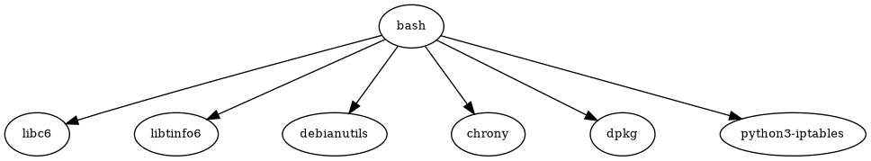

# Инструмент командной строки для визуализации графа зависимостей

Это программа для построения графа зависимостей пакетов с использованием `apk` и визуализации графа с помощью Graphviz.

## Задание №2 

Разработать инструмент командной строки для визуализации графа 
зависимостей, включая транзитивные зависимости. Сторонние средства для 
получения зависимостей использовать нельзя. 
Зависимости определяются по имени пакета ОС Alpine Linux `apk`. Для 
описания графа зависимостей используется представление Graphviz. 
Визуализатор должен выводить результат на экран в виде графического 
изображения графа. 

Ключами командной строки задаются:  
- Путь к программе для визуализации графов. 
- Имя анализируемого пакета. 
- Максимальная глубина анализа зависимостей. 
- URL-адрес репозитория.
  
Все функции визуализатора зависимостей должны быть покрыты тестами.

## Требования

- Python 3.7 или выше
- Установленный Graphviz
- Утилита `apk` для управления пакетами Alpine Linux

## Установка

1. Убедитесь, что Python и pip установлены на вашей системе.
2. Установите библиотеку `graphviz` для Python:

   ```bash
   pip install graphviz
   ```
3. Убедитесь, что `Graphviz` установлен и добавлен в переменную окружения PATH.

   - Для Linux:

     ```bash
     sudo apt install graphviz
     ```
   - Для macOS:

     ```bash
     brew install graphviz
     ```
   - Для Windows:
     Скачайте и установите [Graphviz](https://graphviz.org/download/).

## Запуск программы

Для запуска программы выполните следующую команду:

```bash
python script.py <visualizer_path> <package_name> <max_depth> [repo_url]
```

- `<visualizer_path>`: путь к исполняемому файлу Graphviz (например, `dot`).
- `<package_name>`: имя пакета, для которого строится граф зависимостей.
- `<max_depth>`: максимальная глубина анализа зависимостей.
- `[repo_url]`: (опционально) URL репозитория пакетов.
  
```bash
python script.py /usr/bin/dot bash 2 http://dl-cdn.alpinelinux.org/alpine/v3.18/main
```

После выполнения программы граф зависимостей будет сохранен в файл `dependency_graph.png` и открыт автоматически.
### Изображение графа:



## Полнота тестов:


